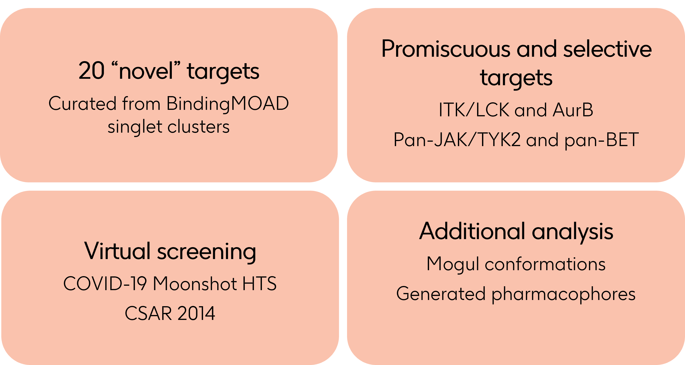

# SBDD-benchmarking
Testing of traditional and 3D deep learning SBDD methods through the development of a benchmark

## Overview
Four SBDD methods are evaluated using this benchmark: DiffSBDD, Pocket2Mol, LigBuilderv3, and AutoGrow4. The model-based methods DiffSBDD and Pocket2Mol are first re-trained on a set of the BindingMOAD dataset, split by ligand similarity, which can be found in `Benchmarking_Tasks/Task0`.

This assessment of this benchmark is split into 4 tasks:

  1. Performance on a blind set of proteins, not part of other Enzyme Commission Numbers seen in BindingMOAD
  2. Performance on selective targets (ITK over AurB and LCK) and promiscuous targets (pan-JAK and pan-BET activities)
  3. Performance on a virtual screening set for COVID-19 Moonshot and CSAR 2014 HTS data
  4. Additional analysis of 3D ligand conformations with Mogul and pharmacophores using RDKit and MOE

For each task, a variety of task-specific and general evaluation criteria are utilised including PoseBusters metrics, MOSES benchmark scores, PLIP interactions, and task-specific ligand-residue interactions.



## Repository structure
- Benchmarking_Tasks
  - Jupyter notebooks containing data curation for tasks 1, 2, and 3
  - Datasets of stored data from ChEMBL, PDB, or BindingMOAD for benchmarking separated into Task folders
  - The Task 0 folder contains the PDBs and SMILES required for re-training

- Analysis_Scripts
  - Re-training loss analysis and inference evaluation notebooks <br />

- sbdd_bench
  - Main module containing sbdd_inference and sbdd_analysis sub-modules used to run inference on chosen SBDD methods and run analysis on task-specific metrics, respectfully
  
# Usage
## 1. Re-training and inference
The re-training of DiffSBDD and Pocket2Mol was performed by following the instructions and data cleaning on their respective repositories. The re-trained model checkpoints can be found under `retrained_ckpts/{model_name}.pt`. The resources and timings for each method can be seen below:

|  | DiffSBDD | Pocket2Mol |
|--- | --- | --- |
| Wallclock time | 4-21:45:07 | 2-04:08:06 |
| Resource | 1 RTX-3090 and 1 A6000 GPU | 4 A6000 GPUs |

Inference was queued on Linux clusters using the `sbdd_bench.sbdd_inference` module per model and task.

Conda environments were created for each SBDD method using the information in their repositories whose yaml configuration files can be found in `envs/{method}.yaml`

To run a round of inference, for example with DiffSBDD for task 1 sampling 1000 molecules, run the following on the command line

```
source activate {model_specific_environment}
python run_inference.py --data_dir <task1_PDBs_SDF_locations> --task_num 1 --model_s_dict '{"DiffSBDD": {"dir": <path_to_diffsbdd_repo>, "ckpt_file": <path_to_retrained_ckpt_file>}}' --num_mols 1000 --output_dir <path_to_output_dir>
```

## 2. SBDD task analysis
The environment for task assessment can be found under `envs/sbdd_analysis_env.yaml`. To create a new environment without the yaml:

```
module load mamba
conda create --name {analysis_env_name} python=3.10.14
```

Activate your environment

```
source activate {analysis_env_name}
```

Download packages

```
conda install pytorch cudatoolkit=10.2 -c pytorch
conda install conda-forge::matplotlib
conda install conda-forge::pandas
conda install conda-forge::openbabel
conda install anaconda::networkx
conda install anaconda::scipy
pip install posebusters
```

Inside this SBDD-benchmarking repository folder, run the following command to install the `sbdd_bench` package
```
pip install .
```

The [PLIP](https://github.com/pharmai/plip) repository* and [prot-lig-combine](https://github.com/gsk-tech/prot-lig-combine) repository need to be cloned. Once inside each of these folders, with the your conda environment activated, run the command
```
pip install .
```

To run a round of analysis, for example with Pocket2Mol for tasks 1, 2, and 3, run the following on the command line or queue a bash script calling the `run_analysis.py` file

```
source activate {analysis_env_name}
python run_analysis.py --model_name "Pocket2Mol" --analysis_output_dir <output_dir_to_write_analysis> --inference_output_dirs <task1_Pocket2Mol_inference_dir> <task2_Pocket2Mol_inference_dir> <task3_Pocket2Mol_inference_dir> --inp_task_files <task1_csv_file> <task2_csv_file> <task3_csv_file> 
```

*NOTE: The PLIP repository's `setup.py` file may require you to comment out openbabel as a requirement - since we have already installed it with conda this will not be an issue.

## 3. SBDD full plots and evaluation
The Jupyter notebooks found under the `Analysis Scripts` directory should be used for loss plot analysis and final plot creation and visualisation of model performance.
